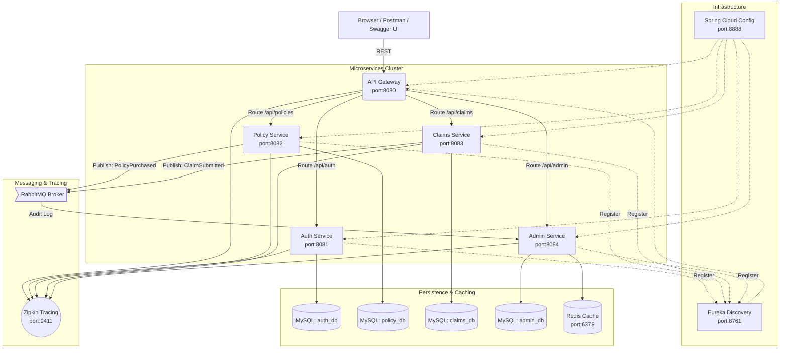

# 🚀 SmartSure Microservices System: Evaluation & Demo Guide

This guide provides a comprehensive technical roadmap for evaluating the **SmartSure Insurance Management System**. It covers the architecture, setup, interactive demo scenarios, and a framework for assessing microservices excellence.

---

## 🏗️ 1. Architecture & Design Patterns

The system is built on a **Cloud-Native Architecture** using Spring Boot 3 and Spring Cloud 2024. It demonstrates high decoupling, asynchronous communication, and robust observability.

### System Architecture


### Advanced Patterns Implemented
1.  **Idempotent API**: `IdempotencyInterceptor` in Policy and Claims services prevents duplicate processing (using `Idempotency-Key` header).
2.  **Circuit Breaker (Resilience4j)**: Graceful fallbacks when downstream services are offline.
3.  **Distributed Caching (Redis)**: High-performance dashboard and report generation in Admin Service.
4.  **Event-Driven Auditing**: Asynchronous audit logging via RabbitMQ.
5.  **Distributed Tracing**: End-to-end request tracking with Micrometer Tracing and Zipkin.

---

---

## ⚙️ 2. Step-by-Step Execution Guide

### Phase 1: Environment Readiness
1.  **MySQL Database Setup**: Run the following commands in your MySQL terminal:
    ```sql
    CREATE DATABASE IF NOT EXISTS auth_db;
    CREATE DATABASE IF NOT EXISTS policy_db;
    CREATE DATABASE IF NOT EXISTS claims_db;
    CREATE DATABASE IF NOT EXISTS admin_db;
    ```
2.  **Infrastructure Services**: Ensure the following are running:
    *   **RabbitMQ**: `localhost:5672` (Management: `localhost:15672`)
    *   **Redis**: `localhost:6379`
    *   **Zipkin**: `localhost:9411`

### Phase 2: Project Import (Eclipse)
1.  Open Eclipse.
2.  Go to **File > Import > Existing Maven Projects**.
3.  Browse to the root directory `case1` and select all microservices.
4.  **Important**: If you see compilation errors, right-click on the project > **Maven > Update Project... > Force Update**.

### Phase 3: Start Sequence (CRITICAL)
Start the services in this exact order to avoid discovery failures:
1.  **Eureka Server** (Port: 8761) — *Wait for UI to be up.*
2.  **Config Server** (Port: 8888) — *Wait 10 seconds.*
3.  **API Gateway** (Port: 8080)
4.  **Auth Service** (Port: 8081)
5.  **Policy Service** (Port: 8082)
6.  **Claims Service** (Port: 8083)
7.  **Admin Service** (Port: 8084)

---

---

## 🚦 3. Interactive Demo Playbook

Use **Swagger UI** for an interactive experience.
- **API Gateway (Aggregated):** `http://localhost:8080/swagger-ui.html`

### Scenario 1: Admin Initialization
1.  **Register as Admin** (`POST /api/auth/register`):
    ```json
    {
      "name": "Super Admin",
      "email": "admin@smartsure.com",
      "password": "adminpassword",
      "phone": "9999999999",
      "address": "Admin HQ",
      "role": "ADMIN"
    }
    ```
2.  **Authorize in Swagger**:
    *   Click the **Authorize** button at the top right of the Swagger UI.
    *   Paste the returned `token` into the value field and click **Authorize**.
3.  **Create a Policy Product** (`POST /api/admin/policies`):
    *Note: The `id` is auto-generated by the database, so do not provide it in the request.*
    ```json
    {
      "name": "Global Health Shield",
      "description": "Comprehensive international coverage",
      "basePremium": 25000.0,
      "coverageAmount": 5000000.0,
      "durationMonths": 12
    }
    ```

### Scenario 2: Customer Journey
1.  **Register Customer** (`POST /api/auth/register`):
    ```json
    {
      "name": "Alice Smith",
      "email": "alice@example.com",
      "password": "securepwd123",
      "phone": "9876543210",
      "address": "789 Green Park"
    }
    ```
2.  **Purchase Policy** (`POST /api/policies/purchase`):
    *Header: `Idempotency-Key: purchase-alice-001`*
    ```json
    { "userId": 2, "policyTypeId": 1 }
    ```
3.  **Initiate Claim** (`POST /api/claims/initiate`):
    ```json
    {
      "policyId": 1,
      "userId": 2,
      "description": "Minor surgery reimbursement"
    }
    ```

### Scenario 3: Admin Review & Reporting
1.  **Review Pending Claims** (`GET /api/admin/claims/pending`)
2.  **Approve Claim** (`PUT /api/admin/claims/1/review`):
    ```json
    { "status": "APPROVED", "remarks": "Documents verified." }
    ```
3.  **View Dashboard** (`GET /api/admin/reports/dashboard`) - *Notice the < 5ms response time on subsequent calls due to Redis caching.*

---

## 📊 4. Evaluation Framework

Evaluate the system based on the following criteria:

| Metric | Target | Verification Method |
| :--- | :--- | :--- |
| **Fault Tolerance** | Zero System Crash | Stop `Claims Service`; call `GET /api/admin/reports`. Admin should return a fallback message. |
| **Data Consistency** | Eventual Consistency | Purchase a policy; check `admin_audit_logs` table. The record should appear asynchronously. |
| **Scalability** | Linear Scaling | Spin up a second instance of `Policy Service`. Gateway should load balance (check port in logs). |
| **Observability** | Full Traceability | Check Zipkin (`localhost:9411`). Find the trace for `Policy Purchase` showing Gateway -> Policy -> RabbitMQ. |
| **Security** | JWT Enforcement | Attempt `GET /api/admin/users` without using the Swagger **Authorize** button. Expect HTTP 403/401. |

---

## 🛠️ 5. Troubleshooting (Common Issues)

### 503 Service Unavailable
If you get a 503 error with the message "Policy service is currently unavailable", it means the Admin Service cannot communicate with the Policy Service.

1.  **Check Eureka**: Go to `http://localhost:8761` and verify `POLICY-SERVICE` is listed as **UP**.
2.  **Verify Database**: Ensure you have created the `policy_db` in MySQL.
3.  **Refresh Maven**: Right-click each microservice in Eclipse > **Maven > Update Project...** (Check "Force Update").
4.  **Check Response Message**: I have updated the code to include the **Reason** in the 503 error message. Check the response body in Swagger; it will now say something like:
    `"Reason: Connection refused"` or `"Reason: policy-service: Unknown host"`. 

---

> [!TIP]
> **Pro Tip:** To demonstrate **Idempotency**, try clicking "Execute" twice on the `Policy Purchase` endpoint with the same `Idempotency-Key`. The second call will return `409 Conflict`, protecting the system from double charging!
